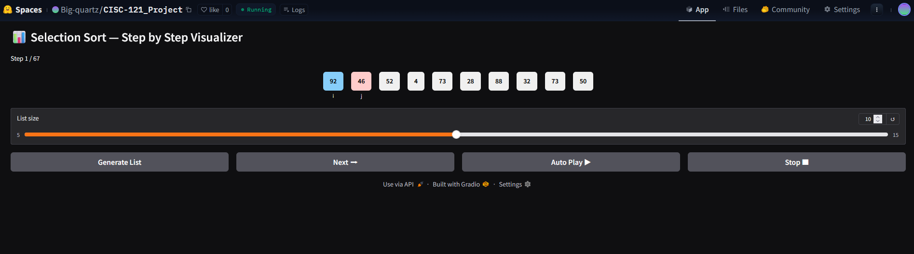
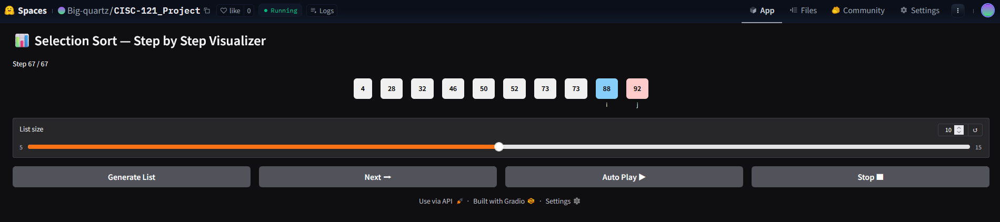

# CISC-121_Project - Selection Sort Visualizer
## Screenshots of test

## Problem breakdown and computational thinking
i choose selection sort, as i found the algorithim interesting and straightforward. which made visualizing it a bit easier.
### Decomposition: What smaller steps form your chosen algorithm?
- repeatedly find the smallest element in the unsorted part of the array and store its index, do this by iterating thourgh it with a pointer
- establist another pointer that acts as the boundary between sorted and unsorted part of the array
- after iterating through the unsorted part check if boundary is the smallest integer, if not swap the array[min] and array[boundary]
- now move boundary by 1 and continue until the array is sorted
### Pattern Recognition: How does it repeatedly reach, compare, or swap values?
- as mentioned, start at boundary
- iterate thourgh unsorted portion
- continously trach the idex of the minimun value
- after the iteration
  - check if minimum and boundary are at the same position if not swap
move boudnary and repeat
### Abstraction: Which details of the process should be shown to the user and how to show it, and which details should be discarded (i.e., not shown)?
- i will be showing how the algorithim works step by step
- so i will show the two pointers(boundary and checker that iterates), the current min and the list
- esentially i will be showing the user the entire process
### Algorithm Design: How will input → processing → output flow to and from the user? Including the use of the graphical user interface (GUI).
- user selects the list size using the slider
- user clicks generate list to start the algorithim
  - goes into generate(n) which does:
  - random_list(n) generates a list to random integers
  - ction_sort(list) iterates through and stores every step as a list of dictionaries
  - outputs the initial state through the visualizer
- if user clicks next
  - goes into next_step(...) funciton
  - which will  output the next state
- if user clicks auto play
  - it will show the next step every .75s
- if user licks stop
  - it will stop the auto play
- so the input the input-processing-output flow varies based on the users action

- for the flowchart i made one for the input-processing-output flow, and abstracted the specific coding process.
- assumed correct input/user decision for flowchart
   
  
